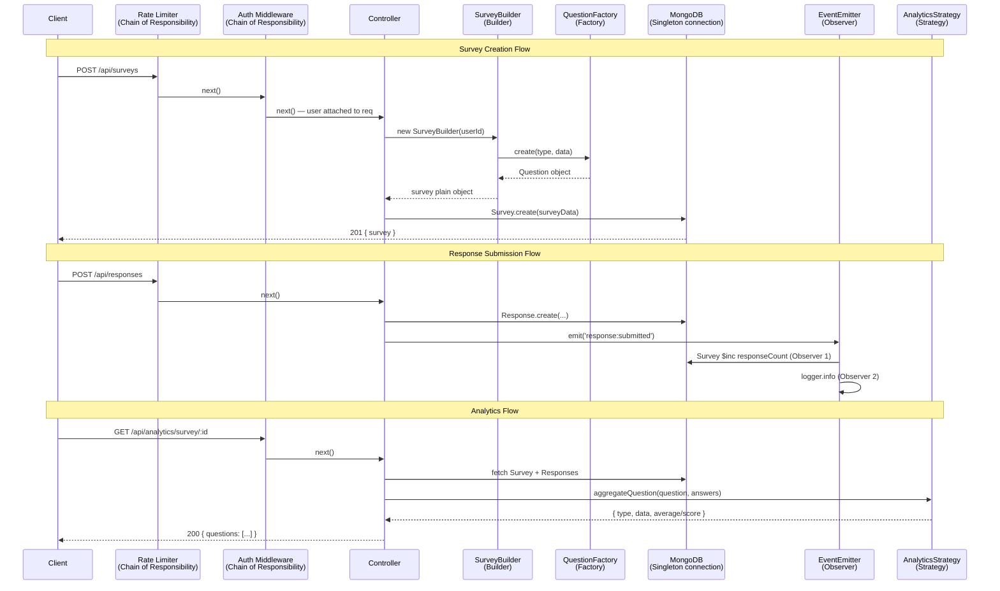

# SentiScope — Design Patterns Documentation

This document describes the **6 GoF (Gang of Four) design patterns** used in SentiScope, a MERN stack survey platform. For each pattern, we explain the **classification**, **intent**, **where it appears in the code**, and **why it was chosen**.

---

## Table of Contents

1. [Singleton](#1-singleton)
2. [Factory](#2-factory)
3. [Builder](#3-builder)
4. [Observer](#4-observer)
5. [Strategy](#5-strategy)
6. [Chain of Responsibility](#6-chain-of-responsibility)
7. [Pattern Interaction Diagram](#pattern-interaction-diagram)
8. [Pattern Summary Table](#pattern-summary-table)

---

## 1. Singleton

**Classification:** Creational

**GoF Intent:**
> "Ensure a class has only one instance, and provide a global point of access to it."

### Where It's Used

| Instance | File |
|----------|------|
| Database connection | `backend/config/db.js` |
| Application logger | `backend/utils/logger.js` |

### Implementation

**`backend/config/db.js`** — The `connectDB()` function stores the connection in a module-level `connection` variable. On subsequent calls it returns the existing connection rather than opening a new one. Node.js module caching ensures the variable is shared across all `require()` calls.

```js
let connection = null;

async function connectDB() {
  if (connection) return connection;          // Singleton guard
  connection = await mongoose.connect(uri);
  return connection;
}
```

**`backend/utils/logger.js`** — Uses an explicit class-level `instance` property to demonstrate the canonical GoF Singleton structure:

```js
class Logger {
  constructor() {
    if (Logger.instance) return Logger.instance;  // Return existing instance
    Logger.instance = this;
  }
}
module.exports = new Logger();
```

### Why This Pattern?

A MongoDB connection is expensive to establish and should be shared. Creating multiple connections per request would exhaust the database's connection pool. Similarly, a logger must be consistent — if different modules use different logger instances, log output becomes fragmented. Singleton guarantees both are instantiated exactly once and reused everywhere.

---

## 2. Factory

**Classification:** Creational

**GoF Intent:**
> "Define an interface for creating an object, but let subclasses decide which class to instantiate."

### Where It's Used

| Location | File |
|----------|------|
| Backend question creation | `backend/patterns/QuestionFactory.js` |
| Frontend question rendering | `frontend/src/components/survey/QuestionRenderer.jsx` |

### Implementation

Each question type (MCQ, Text, Rating, NPS) is a separate class that extends a base `Question` class. The factory's `create()` method takes a type string and returns the correct instance:

```js
class QuestionFactory {
  static create(type, data) {
    const types = {
      mcq:    MCQQuestion,
      text:   TextQuestion,
      rating: RatingQuestion,
      nps:    NPSQuestion,
    };
    const QuestionClass = types[type];
    if (!QuestionClass) throw new Error(`Unknown question type: ${type}`);
    const question = new QuestionClass(data);
    question.validate();
    return question;
  }
}
```

On the frontend, `QuestionRenderer.jsx` applies the same principle — a map from type to React component:

```js
const questionComponents = { mcq: MCQQuestion, text: TextQuestion, ... };
const Component = questionComponents[question.type];
return <Component question={question} value={value} onChange={onChange} />;
```

### Why This Pattern?

The survey domain has inherently different question types that share a common interface (text, required, order) but differ in structure (MCQ has `options`, NPS has `npsLabels`, Rating has `maxRating`). Without Factory, creation logic and type-checking would be scattered across every controller and service. With Factory, adding a new question type (e.g., a `checkbox` type for future sentiment-tagged responses) requires only: one new class and one new entry in the map. This is a direct application of the **Open/Closed Principle**.

---

## 3. Builder

**Classification:** Creational

**GoF Intent:**
> "Separate the construction of a complex object from its representation so that the same construction process can create different representations."

### Where It's Used

| Location | File |
|----------|------|
| Survey construction | `backend/patterns/SurveyBuilder.js` |
| Used in survey service | `backend/services/survey.service.js` |
| Used in template cloning | `backend/services/template.service.js` |

### Implementation

`SurveyBuilder` provides a fluent API to assemble a survey step by step:

```js
class SurveyBuilder {
  constructor(userId) {
    this.survey = { createdBy: userId, questions: [], status: 'draft', settings: {...} };
  }
  setTitle(title)           { this.survey.title = title; return this; }
  setDescription(desc)      { this.survey.description = desc; return this; }
  addQuestion(data)         { /* calls QuestionFactory, appends */ return this; }
  setSettings(settings)     { Object.assign(this.survey.settings, settings); return this; }
  setClonedFrom(templateId) { this.survey.clonedFrom = templateId; return this; }
  build()                   { /* validates, returns plain object */ }
}
```

**Custom survey creation:**
```js
new SurveyBuilder(userId).setTitle('My Survey').addQuestion({type:'rating',...}).build();
```

**Template cloning** (same builder, different input source):
```js
new SurveyBuilder(userId).setTitle(template.name).setClonedFrom(template._id)
  // loop through template.questions
  .addQuestion(q).build();
```

### Why This Pattern?

A `Survey` object has many optional parts: title, description, questions list, settings (4 sub-fields), welcome message, ending message, and a `clonedFrom` reference. A constructor with all these parameters would be unreadable (the "telescoping constructor" anti-pattern). Builder solves this elegantly. Crucially, it also **unifies two different creation flows** — building from scratch and cloning from a template — behind the same interface, eliminating code duplication.

---

## 4. Observer

**Classification:** Behavioural

**GoF Intent:**
> "Define a one-to-many dependency between objects so that when one object changes state, all its dependents are notified and updated automatically."

### Where It's Used

| Location | File |
|----------|------|
| Event emitter | `backend/patterns/EventEmitter.js` |
| Triggered in response service | `backend/services/response.service.js` |

### Implementation

A Node.js `EventEmitter` instance acts as the Subject. Listeners (Observers) register independently:

```js
const surveyEvents = new EventEmitter();

// Observer 1: Update response count
surveyEvents.on('response:submitted', async (response) => {
  await Survey.findByIdAndUpdate(response.surveyId, { $inc: { responseCount: 1 } });
});

// Observer 2: Audit log
surveyEvents.on('response:submitted', (response) => {
  logger.info(`New response for survey ${response.surveyId}`);
});

// Future Observer 3 (sentiment analysis):
// surveyEvents.on('response:submitted', async (response) => { ... });
```

When a respondent submits, the service emits the event and returns immediately:
```js
const response = await Response.create({ ... });
surveyEvents.emit('response:submitted', response);  // Notifies all observers
```

### Why This Pattern?

When a survey response is submitted, multiple side effects must occur: the response count must be incremented, the event must be logged, and in the future, sentiment analysis must run. Without Observer, all of this logic would be crammed into the `submitResponse` service function, creating tight coupling. With Observer, the service only knows "a response was submitted" — it doesn't know or care what happens next. Adding the future sentiment analysis listener requires **zero changes to existing code**. This is a direct demonstration of the **Open/Closed Principle** in a behavioural context.

---

## 5. Strategy

**Classification:** Behavioural

**GoF Intent:**
> "Define a family of algorithms, encapsulate each one, and make them interchangeable."

### Where It's Used

| Location | File |
|----------|------|
| Analytics aggregation | `backend/patterns/AnalyticsStrategy.js` |
| Used in analytics service | `backend/services/analytics.service.js` |
| Chart selection (frontend) | `frontend/src/pages/SurveyAnalytics.jsx` |

### Implementation

Each question type has a concrete Strategy class with an `aggregate(question, answers)` method:

```js
class MCQAggregationStrategy {
  aggregate(question, answers) { /* count occurrences per option */ }
}
class RatingAggregationStrategy {
  aggregate(question, answers) { /* compute average and histogram */ }
}
class NPSAggregationStrategy {
  aggregate(question, answers) { /* promoters / passives / detractors / NPS score */ }
}
class TextAggregationStrategy {
  aggregate(question, answers) { /* return raw text list; future: sentiment scores */ }
}
```

The context function selects the strategy at runtime:
```js
const strategies = { mcq, rating, nps, text };

function aggregateQuestion(question, answers) {
  return strategies[question.type].aggregate(question, answers);
}
```

On the frontend, the same pattern selects the chart component:
```js
const chartComponents = { mcq: MCQChart, rating: RatingChart, nps: NPSChart, text: TextResponses };
const ChartComponent = chartComponents[q.questionType];
```

### Why This Pattern?

MCQ analytics (counting option frequencies) is fundamentally different from NPS analytics (computing promoter/detractor ratios) or rating analytics (computing averages and histograms). Without Strategy, the analytics service would contain a large `switch` statement, and every new question type would require modifying that block. Strategy encapsulates each algorithm independently. When sentiment analysis is added to text responses, **only `TextAggregationStrategy` changes** — the rest of the analytics pipeline is untouched.

---

## 6. Chain of Responsibility

**Classification:** Behavioural

**GoF Intent:**
> "Avoid coupling the sender of a request to its receiver by giving more than one object a chance to handle the request."

### Where It's Used

| Middleware | File |
|------------|------|
| Rate limiting | `backend/middleware/rateLimiter.js` |
| JWT authentication | `backend/middleware/auth.js` |
| Request validation | `backend/middleware/validate.js` |
| Error handling | `backend/middleware/errorHandler.js` |

### Implementation

Express middleware is a direct implementation of Chain of Responsibility. Each handler either handles the request (stops the chain) or calls `next()` to pass it forward:

```js
// Route definition — explicit chain
router.post('/login',
  authLimiter,          // Link 1: Rate limit — rejects if too many requests
  validate(loginSchema),// Link 2: Validate — rejects if body is malformed
  authController.login  // Link 3: Controller — processes and responds
);

// auth.js — Link example
function authenticate(req, res, next) {
  const token = req.headers.authorization?.split(' ')[1];
  if (!token) return res.status(401).json({ error: 'No token' }); // Handled — chain stops
  try {
    req.user = jwt.verify(token, jwtSecret);
    next(); // Pass to next handler
  } catch {
    res.status(401).json({ error: 'Invalid token' }); // Handled — chain stops
  }
}

// errorHandler.js — Final catch-all link
function errorHandler(err, req, res, next) {
  res.status(err.statusCode || 500).json({ error: err.message });
}
```

### Why This Pattern?

HTTP request processing is inherently sequential: a request must be rate-checked before authentication, authenticated before validation, validated before business logic, and any unhandled error must be caught at the end. Each concern is independent and composable. Chain of Responsibility makes this pipeline explicit and extensible — adding a new middleware (e.g., CORS checking, request logging, API key validation) requires inserting one link into the chain with no changes to other handlers.

---

## Pattern Interaction Diagram



---

## Pattern Summary Table

| # | Pattern | Category | File(s) | Problem Solved |
|---|---------|----------|---------|----------------|
| 1 | **Singleton** | Creational | `config/db.js`, `utils/logger.js` | One DB connection, one logger across the entire app |
| 2 | **Factory** | Creational | `patterns/QuestionFactory.js`, `QuestionRenderer.jsx` | Create correct question type without scattered if-else |
| 3 | **Builder** | Creational | `patterns/SurveyBuilder.js` | Construct complex surveys step-by-step; unify create & clone flows |
| 4 | **Observer** | Behavioural | `patterns/EventEmitter.js` | Decouple response submission from its side effects |
| 5 | **Strategy** | Behavioural | `patterns/AnalyticsStrategy.js`, `SurveyAnalytics.jsx` | Swap analytics algorithms per question type without conditionals |
| 6 | **Chain of Responsibility** | Behavioural | `middleware/` | Sequential request processing: rate limit → auth → validate → handle → error |

---

*All patterns are from: Gamma, E., Helm, R., Johnson, R., & Vlissides, J. (1994). Design Patterns: Elements of Reusable Object-Oriented Software. Addison-Wesley.*
